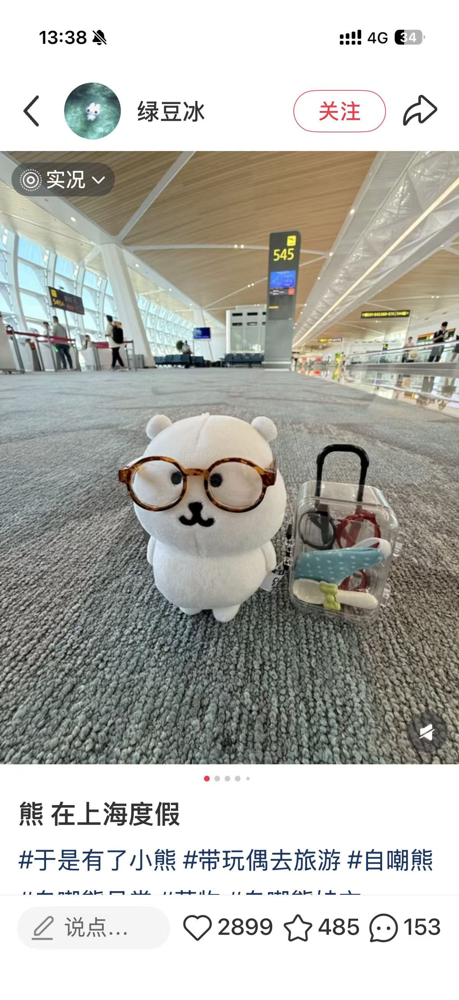
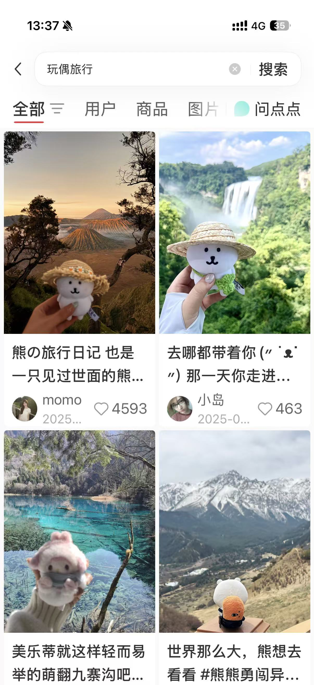

# Toy Dairy

一个让玩偶拥有“灵魂”的 AI 生命记录平台。用户可以为玩偶创建身份与性格，并通过照片持续记录玩偶陪伴自己旅行、生活和成长的过程。

### 产品基本信息

- **名称：**

- **主题：**`Reverse`

- **赛道：**

- **技术栈：**

- **硬件：**

## 产品应用背景与意义

### 市场调研

越来越多年轻人会带着玩偶旅行、拍照记录，将玩偶作为情感陪伴和记忆载体。但目前玩偶更多只是照片中的“物品”，缺少属于自己的身份、故事和成长轨迹。因此，希望通过 AI 赋予玩偶人格，让它成为用户旅程中的陪伴者与记录者。

### 目标用户

喜欢购买、收藏和携带玩偶旅行的年轻人，以及希望通过玩偶记录生活、表达情绪和获得陪伴感的用户。

### 用户使用流程

购买玩偶→ 创建玩偶身份→ 生成玩偶身份卡→ 上传旅行 或日常照片→ AI 识别时间、地点和场景→ 生成玩偶第一视角日记→ 保存至成长时间轴→ 更新旅行地图与成长档案→ 在特定日期触发纪念回顾

### 核心体验

1. 用户买到新玩偶后做「玩偶身份卡」

> 🧸 小熊 Luna
> 
> 出生日期：2026\.07\.23
> 
> 出生地：上海迪士尼
> 
> 星座：巨蟹座（根据出生日期自己ai确定星座）
> 
> 性格：温柔、胆小但好奇
> 
> 人设：“一只相信世界很大的熊，最大的梦想是看遍世界所有日落。”
> 
> 

形成玩偶身份卡片

2. 用户把打卡拍照的照片上传至app形成「旅行生命日志」

AI结合玩偶自身性格去ai生成对应的文案

> 2026年4月3日，鼓浪屿
> 
> 今天主人带我来看日落。海风有点大，但我终于知道，太阳回家时，天空会变成橘子汽水的颜色。
> 
> 

日志可自动生成AI文案、手帐页面、旅行地点、玩偶成长时间轴

3. app中展示特定天数的纪念日

app首页（顶端？）会展示特定日期的纪念卡片：

- 入口卡片视觉设计：

    - **主标题**：事件名称（如：“和玩偶相识”、“大理时光”）

    - **核心天数**：超大字号显示当前天数（如 `100` DAYS），配以温馨的粒子光效或手绘质感插画。

    - **玩偶气泡**：卡片右下角贴着玩偶的卡通 Avatar，带着一句当下心态的独白（如：第 100 天啦，谢谢你总是把心事说给我听\~）

- 点击任意特定天数卡片进入，呈现的是（**以玩偶视角）为用户整理的回忆展厅**：

    - 数据收集\&展示：

    > “在这 100 天里，你一共向我倾诉了 **24 次** 心事。”
    > 
    > “你带着我去了 **2 个** 城市（大理、成都）。”
    > 
    > “你最常在 **深夜 23:00** 和我聊天。”
    > 
    > 

    - 画面幻灯片：对标（IOS照片），将（这一期间中）相关的照片将被整理成幻灯片并与照片Matadata一并展示。（动画待定）

- 「分享」功能：在特定天数当天，App 可一键生成一张极具复古文艺感的“拍立得风格卡片”

    - 类似：

4. 「玩偶成长档案」

（新页面）系统根据用户持续上传的内容，去记录：陪伴天数、到访过的城市\-可以结合地图打卡的形式、旅行次数、性格变化。形成一本可以持续更新的《玩偶生命绘本》

5. 玩偶互动（未来延伸）

A用户可以与玩偶进行 AI 对话，玩偶根据自身人格、旅行经历和共同记忆回应。

B后续可以形成 用户之间不同的玩偶自己发动态/话题，进行互相认识、留言和分享旅行故事

## 产品架构设计

### 总体介绍

本产品采用三端协同架构：激活端、移动端与服务端，各司其职，共同构建完整的互动体验。

- **激活端** —— **面向即时交互**，用户可通过它执行快捷操作，与玩偶实现轻量、单向的触发式互动。该端基于通用API接口设计，具备良好的开放性与兼容性，可灵活接入多种硬件及软件平台。

- **移动端** —— **承载高阶互动功能**，包括图传、音视频交互及玩偶对用户的主动反馈等复杂场景，均在移动端得以流畅呈现，为用户提供更丰富、沉浸的操控体验。

- **服务端** —— **作为核心数据中枢，统一存储所有用户数据与设备状态**，确保信息可靠持久，并支持**无缝迁移**，方便在多设备或升级场景下保持体验一致。

### 激活端（增量）

> 这里先不写
> 
> 

### 移动端

#### 操作类别（界面底部菜单）

- **日志** —— 可以上下滑动，点击某一天即可观看详情

    - 进入后UI： 

- **成长档案** —— 查看该玩偶的陪伴天数、旅行地图、成长时间轴

    - 进入后UI：

- **居中加号** ——  上传互动内容

    - 弹出菜单：

        - 拍照

        - 发照片

        - 写文字

- **玩偶设置** —— 为玩偶做人设、性格等设置，也可以在此界面切换不同的玩偶，页面内容会显示用户所切换的玩偶

    - 进入后UI：

        - 设置玩偶人设，性格

- **我的**** **—— 管理用户信息、隐私权限、通知等

**玩偶｜旅行日志｜成长档案｜我的**

中间悬浮一个 **“＋”按钮**，用于随时新增记录。

**详细功能设计**

**加号：**

点击底部“\+”，弹出：

- 从相册选择

- 拍照记录

- 纯文字记录

进入“编辑记录”页面后，用户填写或跳过：

- 关联玩偶

- 记录类型：旅行 / 日常 / 纪念日

- 日期

- 地点

- 标题与补充描述

- 当时的心情

AI 可以自动：

- 识别照片中的玩偶和地点

- 生成日志标题与文案

- 将玩偶照片转成插画

- 生成手账页面

保存后，同步更新对应玩偶的最新日志、旅行地图、到访城市数和成长时间轴。

**玩偶**

玩偶页面右上角设置“新增玩偶”入口。

新增玩偶

用户上传或拍摄玩偶照片，并填写：

- 玩偶名称

- 出生日期

- 出生地

- 身份，如旅行搭子、童年伙伴

- 性格关键词

AI 自动补充星座、生成玩偶头像、性格介绍和玩偶独白。

玩偶主页滑动 \-左滑右滑

玩偶身份卡片：玩偶头像、名字和身份、玩偶独白（ai生成）、纪念日卡片、最新旅行日、 到访城市数

切换换偶之后

点击不同模块，可以进入身份卡、纪念日回忆或具体日志

**旅行日志**

集中查看全部记录：旅行日志 、日常瞬间 、纯文字记录 、纪念日记录 

支持按照时间、地点、玩偶和记录类型筛选。

点击任意日志，进入详情页，查看照片、AI 文案、地点、日期和手账页面。

**今日状态**

每天生成一张玩偶今日状态图，支持一键分享。

页面展示：

- 玩偶今日心情

- 今日插画形象

- 玩偶气泡和今日独白

- 简单互动入口

玩偶今日状态图 可分享

右上角展示玩偶气泡，玩偶今日想对人说的话，以及用户也可以输入话和玩偶对话

附加：

用户拍照玩偶，可以转成插画形式

~~分为几个模块：旅行打卡、ta想和你说、个人档案~~

~~旅行打卡：地图的形式xxx~~

**五、我的｜账户与管理**

主要包括：

- 个人主页

- 玩偶管理

- 通知设置

- 隐私设置

- 内容导出

- 会员与订单

- 意见反馈

个人主页可以展示：

- 玩偶数量

- 累计记录数量

- 相伴天数

- 共同到访城市数

### 增量子任务

> 这里是草稿
> 
> 

玩偶社交功能喵

与小红书、微信等软件联动喵

## 开发时序与分工

